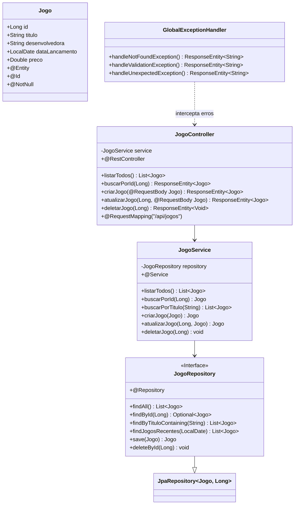

# PsnCatalogAPI
Sistema para catalogar jogos PlayStation, incluindo detalhes preços, data de lançamento e desenvolvedora.

```mermaid
classDiagram
    %% Entidades (Models)
    class Jogo {
        +Long id
        +String titulo
        +String desenvolvedora
        +LocalDate dataLancamento
        +Double preco
    }

    %% Camada de Repositório
    class JogoRepository {
        <<Interface>>
        +findAll() List~Jogo~
        +findById(Long) Optional~Jogo~
        +findByTituloContaining(String) List~Jogo~
        +findJogosRecentes(LocalDate) List~Jogo~
        +save(Jogo) Jogo
        +deleteById(Long) void
    }

    %% Camada de Serviço
    class JogoService {
        -JogoRepository repository
        +listarTodos() List~Jogo~
        +buscarPorId(Long) Jogo
        +buscarPorTitulo(String) List~Jogo~
        +criarJogo(Jogo) Jogo
        +atualizarJogo(Long, Jogo) Jogo
        +deletarJogo(Long) void
    }

    %% Camada Controller
    class JogoController {
        -JogoService service
        +listarTodos() List~Jogo~
        +buscarPorId(Long) ResponseEntity~Jogo~
        +criarJogo(@RequestBody Jogo) ResponseEntity~Jogo~
        +atualizarJogo(Long, @RequestBody Jogo) ResponseEntity~Jogo~
        +deletarJogo(Long) ResponseEntity~Void~
    }

    %% Tratamento de Erros
    class GlobalExceptionHandler {
        +handleNotFoundException() ResponseEntity~String~
        +handleValidationException() ResponseEntity~String~
        +handleUnexpectedException() ResponseEntity~String~
    }

    %% Relacionamentos
    JogoRepository --|> JpaRepository~Jogo, Long~
    JogoService --> JogoRepository
    JogoController --> JogoService
    GlobalExceptionHandler ..> JogoController : intercepta erros

    %% Estilo
    Jogo : +@Entity
    Jogo : +@Id
    Jogo : +@NotNull
    JogoRepository : +@Repository
    JogoService : +@Service
    JogoController : +@RestController
    JogoController : +@RequestMapping("/api/jogos")
```
